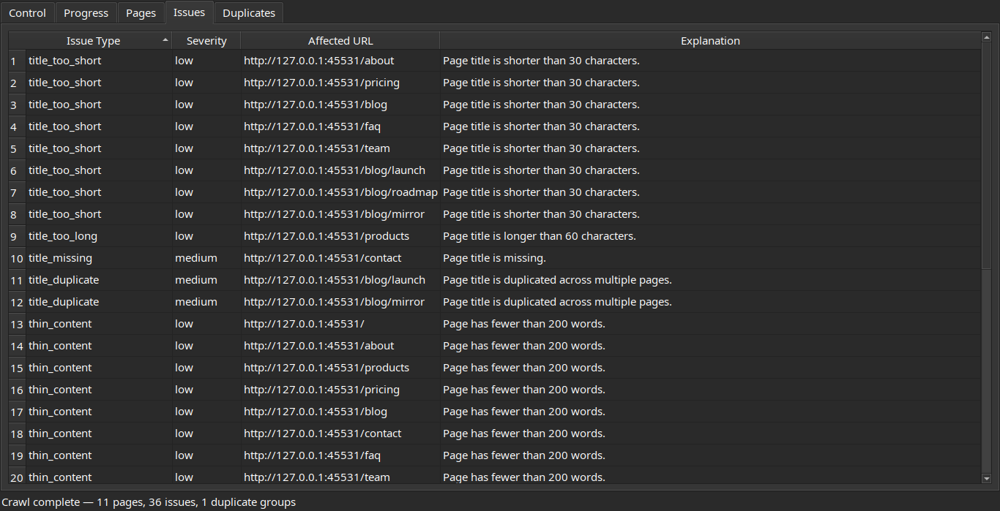
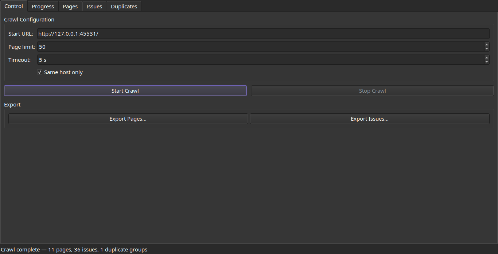
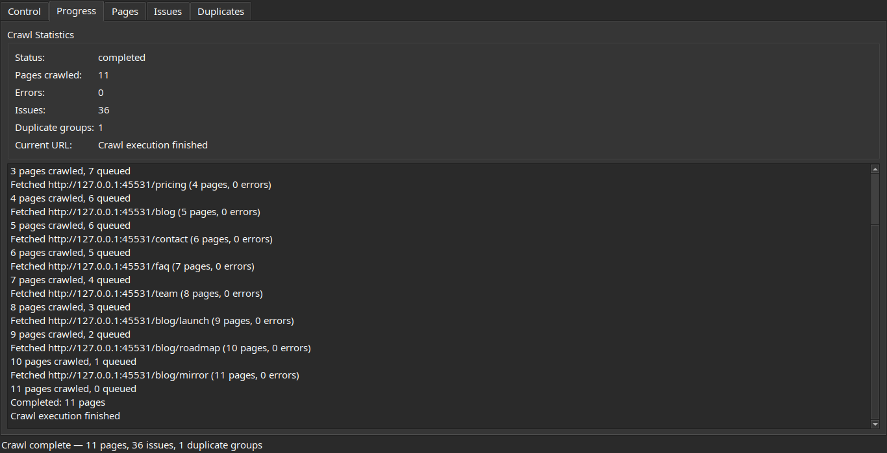
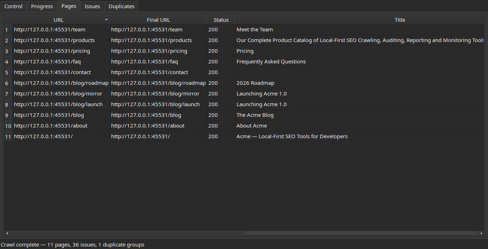
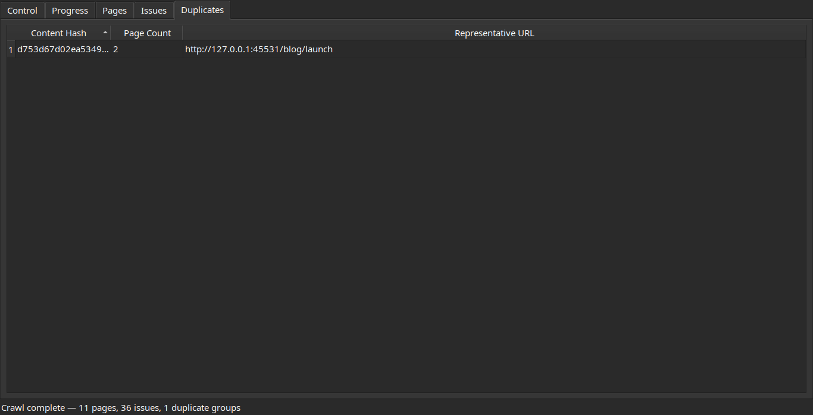
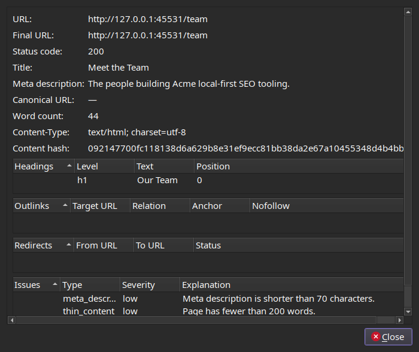

# xseo

[](https://github.com/yuripinto/xseo/actions/workflows/ci.yml)
[](LICENSE)
[](https://www.python.org/downloads/)

> A local-first desktop SEO crawler. Audit your site on your own machine — no cloud, no accounts, no data leaves your computer.

`xseo` is a desktop application that crawls a website, extracts on-page SEO signals, detects common issues and content duplication, and renders the results in a clean UI. Everything runs locally and persists to a single SQLite file under `~/.xseo/`.



## Features

- **Live crawling** with a real-time progress view and a threaded background worker that keeps the UI responsive.
- **On-page extraction** of titles, meta descriptions, headings, canonicals, robots directives, internal/external links, and more via `selectolax`.
- **Issue detection** for missing/duplicate titles and descriptions, thin content, heading problems, broken links, and other common SEO defects.
- **Duplicate content detection** through content hashing and grouped read models.
- **Sortable result tables** for pages, issues, and duplicate groups, with a double-click page detail dialog.
- **CSV export** for every result view, so you can pipe findings into spreadsheets or other tools.
- **Local persistence** in SQLite at `~/.xseo/xseo.sqlite3`. The last crawl is restored automatically on launch.
- **Clean architecture** — domain, application, and adapter layers are strictly separated, with ports/adapters for HTTP, persistence, export, and the UI.

## Screenshots

Configure a crawl, then watch progress stream in live:

| Control | Progress |
| --- | --- |
|  |  |

Review crawled pages, detected issues, and duplicate content groups:

| Pages | Duplicates |
| --- | --- |
|  |  |

Double-click any page for full detail — headings, links, redirects, and per-page issues:



## Tech stack

- **Python 3.12+**
- **PySide6** for the desktop UI
- **httpx** for HTTP fetching
- **selectolax** for fast HTML parsing
- **SQLite** for local storage
- **pytest**, **hypothesis**, and **pytest-qt** for unit, property-based, and UI tests

## Install

```bash
python3 -m pip install -e '.[test]'
```

Requires Python 3.12 or newer.

## Run

Launch the desktop UI:

```bash
xseo-ui
```

Or from the source tree:

```bash
python3 -m xseo.ui.app
```

Enter a URL, click **Start Crawl**, and watch the progress tab fill in. When the crawl finishes, browse pages, issues, and duplicate groups in their respective tabs. Double-click any page row for full detail, or export any view to CSV.

## Verify

```bash
python3 -m compileall src tests
python3 -m pytest -q
```

The current suite has 104 tests covering domain logic, adapters, integration, property-based invariants, and UI smoke tests.

## Project layout

```
src/xseo/
├── domain/         # entities, value objects, ports, validation, events
│   ├── crawler/    # frontier + crawl engine
│   ├── extraction/ # HTML extraction
│   ├── analysis/   # SEO issue detection
│   └── duplicates/ # content duplicate detection
├── application/    # services, commands, queries, read models
├── adapters/       # HTTP, persistence, export, background worker, event bridge
└── ui/             # PySide6 app, widgets, controller
```

## About

I built `xseo` because I needed it. I was starting a new project and wanted a fast way to scan it for SEO issues without uploading URLs to a third-party tool, paying for another subscription, or fighting a heavy web dashboard. I wanted something that ran on my desktop, was honest about what it found, and stored results in a file I owned — so I wrote it, and I'm sharing it in case it's useful to anyone else who wants a small, local, hackable SEO crawler.

This is an early prototype. It works end-to-end and I use it on my own projects, but expect rough edges. Issues and PRs are welcome.

Built by Yuri Silva — [@yurisilvapi on X/Twitter](https://twitter.com/yurisilvapi).
