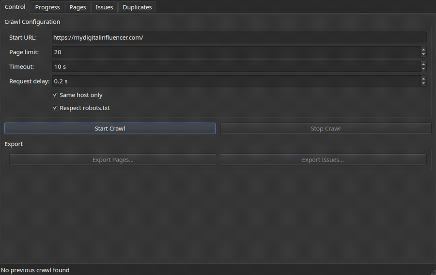

# xseo

[](https://github.com/yuripinto/xseo/actions/workflows/ci.yml)
[](LICENSE)
[](https://www.python.org/downloads/)

> A local-first SEO crawler for your desktop and your terminal. Audit your site on your own machine — no cloud, no accounts, no data leaves your computer.

`xseo` crawls a website, extracts on-page SEO signals, detects common issues and content duplication, and shows the results in a clean desktop UI — or runs **headless from the command line** so you can pipe reports into other tools and gate CI on SEO regressions. Everything runs locally and persists to a single SQLite file under `~/.xseo/`.




## Features

- **Live crawling** with a real-time progress view and a threaded background worker that keeps the UI responsive.
- **Polite by default** — respects `robots.txt` and applies a configurable per-request delay so you don't hammer the sites you audit.
- **On-page extraction** of titles, meta descriptions, headings, canonicals, robots directives, internal/external links, and more via `selectolax`.
- **Issue detection** for missing/duplicate titles and descriptions, thin content, heading problems, broken links, mixed content (http resources on https pages), missing Open Graph tags, missing JSON-LD structured data, non-self-referential hreflang, and other common SEO defects.
- **Duplicate content detection** through content hashing and grouped read models.
- **Sortable result tables** for pages, issues, and duplicate groups, with a double-click page detail dialog.
- **Headless CLI** (`xseo crawl <url>`) that runs the same engine without the GUI — JSON, CSV, HTML, and SARIF reports, an `xseo diff` to compare crawls, and a `--fail-on` exit code, so you can gate CI on SEO regressions.
- **GitHub Action** that runs an audit on every push and uploads findings to the Security → Code scanning tab via SARIF.
- **CSV export** for every result view, so you can pipe findings into spreadsheets or other tools.
- **Local persistence** in SQLite at `~/.xseo/xseo.sqlite3`. The last crawl is restored automatically on launch.
- **Clean architecture** — domain, application, and adapter layers are strictly separated, with ports/adapters for HTTP, persistence, export, and the UI.

## Screenshots

Configure a crawl, then watch progress stream in live:

| Control | Progress |
| --- | --- |
|  |  |

Review crawled pages, detected issues, and duplicate content groups:

| Pages | Duplicates |
| --- | --- |
|  |  |

Double-click any page for full detail — headings, links, redirects, and per-page issues:


## Tech stack

- **Python 3.12+**
- **PySide6** for the desktop UI
- **httpx** for HTTP fetching
- **selectolax** for fast HTML parsing
- **SQLite** for local storage
- **pytest**, **hypothesis**, and **pytest-qt** for unit, property-based, and UI tests

## Install

### Download a ready-to-run build (no Python needed)

Download the build for your OS, unzip it, and run the `xseo` executable inside:

| OS | Download |
| --- | --- |
| macOS (Apple Silicon) | [xseo-macos-arm64.zip](https://github.com/yuripinto/xseo/releases/latest/download/xseo-macos-arm64.zip) |
| Windows (x64) | [xseo-windows-x64.zip](https://github.com/yuripinto/xseo/releases/latest/download/xseo-windows-x64.zip) |
| Linux (x64) | [xseo-linux-x64.zip](https://github.com/yuripinto/xseo/releases/latest/download/xseo-linux-x64.zip) |

These links always point to the most recent release. You can also browse every build on the [Releases page](https://github.com/yuripinto/xseo/releases/latest).

> The builds are not code-signed yet, so the OS may warn you the first time:
> - **macOS:** right-click the app → **Open** → **Open** (or `System Settings → Privacy & Security → Open Anyway`).
> - **Windows:** on the SmartScreen prompt, click **More info → Run anyway**.

### Install from PyPI (for Python users)

```bash
pipx install xseo   # isolated, recommended
# or
pip install xseo
```

Then launch with `xseo-ui`. Requires Python 3.12 or newer.

### From source

```bash
python3 -m pip install -e '.[test]'
```

## Run

Launch the desktop UI:

```bash
xseo-ui
```

Or from the source tree:

```bash
python3 -m xseo.ui.app
```

Enter a URL, click **Start Crawl**, and watch the progress tab fill in. When the crawl finishes, browse pages, issues, and duplicate groups in their respective tabs. Double-click any page row for full detail, or export any view to CSV.

### Command line

`xseo` also runs headless — no GUI, scriptable, and CI-friendly. It uses the same crawl engine and the same SQLite store as the desktop app, so you can audit from the terminal and still open the results in the UI later.

```bash
xseo crawl https://example.com/
```

```text
Crawling https://example.com/ …

Crawled 142 pages, found 38 issues

  HIGH       3  broken_internal_link
  MEDIUM    12  meta_description_missing
  LOW       22  thin_content
```

Write a report in whichever format fits your workflow, or pipe JSON straight to another tool:

```bash
xseo crawl https://example.com/ --out report.json        # full JSON report
xseo crawl https://example.com/ --out - | jq '.summary'  # JSON to stdout
xseo crawl https://example.com/ --format csv  --out issues.csv
xseo crawl https://example.com/ --format html --out report.html   # shareable, self-contained
xseo crawl https://example.com/ --format sarif --out report.sarif # GitHub code scanning
```

Use it as a build gate — `--fail-on` makes the command exit non-zero when an issue at or above the given severity is found, so a regression breaks CI:

```bash
xseo crawl https://example.com/ --fail-on high
```

Compare two crawls to see exactly what changed — which issues are new and which were fixed:

```bash
xseo crawl https://example.com/ --out before.json
# … ship some changes …
xseo crawl https://example.com/ --out after.json
xseo diff before.json after.json --fail-on-new medium
```

Other flags: `--limit`, `--delay`, `--timeout`, `--no-robots`, `--all-hosts`, `--db`. Run `xseo crawl --help` for the full list.

### GitHub Action

Run an audit on every push and surface findings in the **Security → Code scanning** tab:

```yaml
# .github/workflows/seo.yml
name: SEO audit
on: [push]
permissions:
  security-events: write   # required to upload SARIF
jobs:
  seo:
    runs-on: ubuntu-latest
    steps:
      - uses: yuripinto/xseo@v1
        id: xseo
        with:
          url: https://example.com/
          fail-on: high          # break the build on high-severity issues
      - uses: github/codeql-action/upload-sarif@v3
        if: always()
        with:
          sarif_file: ${{ steps.xseo.outputs.report }}
```

## Verify

```bash
python3 -m compileall src tests
python3 -m pytest -q
```

The current suite has 182 tests covering domain logic, adapters, integration, property-based invariants, CLI behavior, report rendering, and UI smoke tests.

## Project layout

```
src/xseo/
├── domain/         # entities, value objects, ports, validation, events
│   ├── crawler/    # frontier + crawl engine
│   ├── extraction/ # HTML extraction
│   ├── analysis/   # SEO issue detection
│   └── duplicates/ # content duplicate detection
├── application/    # services, commands, queries, read models
├── adapters/       # HTTP, persistence, export, background worker, event bridge
└── ui/             # PySide6 app, widgets, controller
```

## Contributing

Contributions are welcome — see [CONTRIBUTING.md](CONTRIBUTING.md) for dev setup, how to run the checks (`ruff` + `pytest`), and the project conventions.

## About

I built `xseo` because I needed it. I was starting a new project and wanted a fast way to scan it for SEO issues without uploading URLs to a third-party tool, paying for another subscription, or fighting a heavy web dashboard. I wanted something that ran on my desktop, was honest about what it found, and stored results in a file I owned — so I wrote it, and I'm sharing it in case it's useful to anyone else who wants a small, local, hackable SEO crawler.

This is an early prototype. It works end-to-end and I use it on my own projects, but expect rough edges. Issues and PRs are welcome.

Built by Yuri Silva — [@yurisilvapi on X/Twitter](https://twitter.com/yurisilvapi).
